# Dionysus 使用说明书

> 写给使用者的一份白话指南。不需要懂任何技术概念，跟着做就行。
> 文档里说的「AI 助手」，指的是 Kimi Code、Claude Code 这类命令行 AI 编程工具；「角色」，指的是陪在你旁边汇报进展的 Live2D 小伙伴（出厂自带的是凯尔希 kal'tsit）。

---

## 1. 一分钟了解 Dionysus

Dionysus 是一个 **VS Code 插件**，它做三件事：

1. **把 AI 编程助手收进一个界面**：你电脑上装的 Kimi Code、Claude Code、Codex、OpenCode、CodeBuddy，Dionysus 都能驱动。像 QQ 一样开多个「会话」，每个会话背后是一个 AI 助手在干活，可以同时跑（默认最多 3 个并行）。
2. **角色陪伴与汇报**：聊天面板里有一位 Live2D 角色在场（出厂是凯尔希）。AI 助手干活时，她会用自己的口吻在旁边汇报进展——「auth 重构做到第 3 步啦」「mobile 那边报错了」。汇报只是旁白，**不会改动 AI 的实际回答**。
3. **手机遥控**：扫一个二维码，手机浏览器里就能看到所有会话的状态、收汇报、替 AI 助手确认选项、打断任务。离开电脑去倒杯水，进展尽在掌握。

另外，AI 助手每读一个文件、改一处代码、跑一条命令，界面上都会实时出现一张「操作卡片」，不用翻日志就能看到它具体做了什么。

---

## 2. 安装与第一次使用

### 2.1 安装插件

从发布渠道拿到 `dionysus-vscode-0.1.0.vsix` 文件后，二选一：

- 终端里执行：`code --install-extension dionysus-vscode-0.1.0.vsix`
- 或在 VS Code 里：打开 `扩展` 面板 → 右上角 `...` → `从 VSIX 安装...` → 选中 vsix 文件。

### 2.2 安装一个 AI 助手 CLI

**Dionysus 本身不含 AI**，它需要一个已经装好并登录过的 AI 助手 CLI。以下任选一个，按它的官方文档安装登录即可：

- Kimi Code
- Claude Code
- Codex
- OpenCode
- CodeBuddy

装好后，在 VS Code 命令面板（`Ctrl/Cmd + Shift + P`）运行 **「Dionysus: 重新检测 AI 助手」**。识别成功会有提示；如果装了多个，会弹出一个简单的选择器问「你想用哪个 AI 助手？」，选完就写进默认设置。一个都没装也不怕——插件不会报错，聊天面板会显示安装引导页（每个 CLI 一句话简介 + 可一键复制的安装命令 + 官方文档链接）。

### 2.3 跟着 Walkthrough 走四步

插件第一次激活时会自动弹出欢迎页 **「Dionysus 上手引导」**，四步：

1. **安装一个 AI 助手 CLI** —— 就是 2.2 做的事，检测到会自动打勾。
2. **打开 Dionysus 聊天** —— 命令面板运行「Dionysus: 打开聊天」，出厂角色凯尔希已经在场了，不用任何放置操作。
3. **完成第一轮对话** —— 见 2.4。
4. **扫码配对手机**（可选）—— 见第 5 章。

随时可以从 VS Code 欢迎页重新打开这个引导。

### 2.4 第一轮对话：你会看到什么

在聊天面板底部输入框布置一个小任务，比如「帮我看看这个项目是干什么的」，回车发送。接下来：

- AI 助手的回复逐字流式出现；
- 它每读文件、改代码、跑命令，对话里都会插入一张**操作卡片**（「正在读取文件 `auth.ts`」这类自然语言描述，转圈 → 完成打勾 → 显示耗时）；
- 右上角陪伴区的角色会插播汇报，气泡右下角标注「来自：某某会话」；
- 回合结束后，会话列表里的这一行会更新摘要和状态。

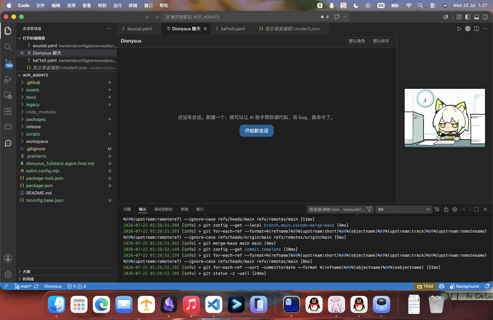

*首次打开聊天面板：左侧是资源管理器，中间是聊天区，右下角陪伴区的凯尔希已就位。*

---

## 3. 日常使用（桌面端）

### 3.1 界面布局一眼看懂

- **左侧活动栏的 Dionysus 图标**：点开是**会话列表**（像 QQ 的联系人列表）。图标上有数字角标 = 有多少事在等你处理（待决策 + 报错 + 未读）。
- **编辑器区的「Dionysus 聊天」面板**：当前会话的聊天流 + 右下角的 Live2D 陪伴区。
- **底部状态栏**：常驻一行「⏳N 运行中 ❗M 待决策」，点一下聚焦会话列表——就算面板被挡住，也不会错过全局进展。

### 3.2 会话管理

**新建会话**：三种方式任选——

- 会话列表底部的「新建会话」按钮；
- 命令面板「Dionysus: 新建会话」；
- 输入框里敲 `/new`。

**在其他目录开会话**：点「新建会话」旁边的「目录」按钮，展开一个小面板——可以直接输入路径，或点「选择目录…」弹系统目录框。留空则用默认目录（默认跟随当前工作区，见第 6 章 `dionysus.workingDir`）。

**切换会话**：在会话列表里点任意一行，聊天面板就切过去了，进入即清零未读。角色也会跟着切——不同会话可以绑定不同角色。

**会话历史**：会话与历史消息由插件自动保存，重开 VS Code 后还在，列表里点开就能继续。如果想恢复 **CLI 自己的历史会话**（比如之前在终端里用 kimi 聊过的），在会话里输入 `/sessions` 查看当前目录下的历史列表，再用 `/resume <会话ID>` 恢复（见 3.4）。

**会话名**：第一轮对话结束后，会自动用你发的第一句话生成标题；自己重命名过之后就不再被自动覆盖。

> 小提示：会话列表目前**没有手动删除按钮**，旧会话会一直留在列表里，随时可以点回去翻看。

### 3.3 会话列表每一项的含义

每一行就是一张「联系人卡片」：

- **圆形头像**：这个会话绑定的角色；没有 Live2D 模型的角色用静态立绘头像。头像右下角的**小圆标**是 AI 助手徽标（CLI 图标/首字母）——同一个角色搭配不同助手时靠它区分。
- **头像旁的状态点**，五种颜色：
  - 灰 = 空闲（idle）
  - 金色呼吸 = 正在思考（thinking）
  - 金色常亮 = 正在执行操作（executing）
  - 橙红 = 等你确认选项（waiting_option）
  - 红 = 出错了（error）
- **一行灰色小字摘要**：干活中优先显示进度和当前动作，比如 `3/7 · 正在改 auth.ts`（意思是「共 7 步待办，做到第 3 步」）；没有待办清单时就显示当前动作（「正在读取 auth.ts」）；空闲时显示最后一条角色汇报。
- **右侧数字角标**：未读——回合完成后新增的回复数，进会话即清零。
- **右侧 ❗**：有选项在等你拍板，它顶替未读角标出现（待决策永远优先）。列表也会把这类会话自动顶到最上面。
- **摘要行右端**：最后活动时间（「3 分钟前」）。

列表顶部的**聚合条**「⏳N 运行中 · ❗M 待决策 · ✅K 已完成」是全局总览，点它可以聚焦陪伴区看最近的全局汇报。

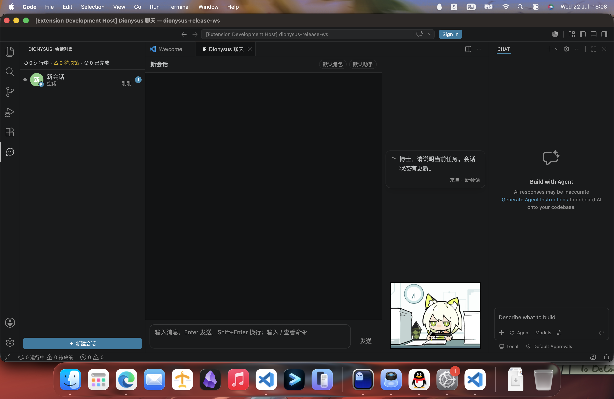

*左侧会话列表（聚合条 + 状态点 + 未读角标），陪伴区的汇报气泡右下角标注了来源会话。*

### 3.4 斜杠命令

在输入框敲 `/` 会弹出候选列表，每条带一句白话说明：

| 命令 | 作用 |
|---|---|
| `/new` | 创建新会话 |
| `/sessions` | 列出全部会话（含当前目录下的 CLI 历史会话，恢复用） |
| `/resume <会话ID>` | 恢复一个 CLI 历史会话（ID 从 `/sessions` 的输出里抄） |

### 3.5 打断与排队

- **打断**：AI 助手干活时，聊天标题栏会出现「打断」按钮（命令面板里也有「Dionysus: 打断当前任务」）。点了就立刻停。
- **排队**：回合还没结束时你又发了一条消息，不会丢——会提示「新输入已排队」，当前回合结束后自动发送。

### 3.6 选项确认（AI 助手问你话时）

有时 AI 助手会停下来问你：「检测到旧配置，如何处理？」并在对话里给出一组选项按钮。这时：

- 会话状态变橙红，列表项出现 ❗，活动栏角标 +1；
- 点一个选项，它继续干活；
- 一直不选的话，超时后的默认动作由设置 `dionysus.session.optionTimeoutAction` 决定（默认 `keep` = 一直等你，不会自作主张；也可改成视为拒绝或采用默认选项，见第 6 章）。

### 3.7 todo 进度面板与操作卡片

- **todo 进度**：AI 助手干活前列的待办清单会实时显示进度（列表摘要里的 `3/7` 就是它）。桌面聊天流和手机的「工作状态页」（见 5.3）都能看到清单明细，做完一项划掉一项。
- **操作卡片**：每次读文件/改代码/跑命令一张卡片——自然语言标题（「正在修改 `login.tsx`」）+ 状态（转圈 / ✓ / ✗ 标红）+ 耗时。改代码的卡片最醒目（金色描边），命令行用等宽字体展示。原始参数默认折叠，点卡片可展开看详情。同一回合的一串操作默认折叠成一行计数（「本回合已执行 14 项操作 · 正在：读取 auth.ts」），点开看明细；回合结束后整体折叠，仍可展开回看。

---

## 4. 角色陪伴

### 4.1 汇报气泡怎么看

角色说的话显示在她上方的台词气泡里，特点是：

- **跨会话常驻**：切换会话气泡不消失，它是「全局广播员」。
- **来源标注**：多会话并行时，气泡右下角小字标注「来自：某某会话」，点一下直接跳到那个会话。
- **同屏最多 3 条**，旧句自动下沉，更多进历史。
- **不刷屏**：播报有节奏控制（最少 3 秒一句、没事不重复播报、错误和打断优先插播），几个会话同时完工会合并成一句「2 个任务还在跑，auth 重构已经完工咯」。

### 4.2 触摸互动

桌面端 Live2D 状态下，用鼠标点角色的**头部**或**身体**，她会随机回你一句话并换个表情（台词由角色配置里的 touch_zones 决定，点了没反应说明该角色没配触摸台词）。

### 4.3 切换角色

- 命令面板运行「Dionysus: 选择角色」，或
- 打开「Dionysus: 角色与素材库设置」，在角色列表里切换。

角色跟随会话：不同会话绑定不同角色，切会话时角色自动换（模型切换有加载动画，加载失败自动降级为静态立绘，不影响任何功能）。

### 4.4 客制化：打造你自己的角色

运行「Dionysus: 角色与素材库设置」，打开设置面板，分两块：

**① 角色语气（voice 表单）**——自创角色本质是填五个字段：

| 字段 | 怎么填 |
|---|---|
| 语气描述 | 一句话，如「冷静克制，偶尔毒舌」 |
| 口头禅 / 句尾口癖 | 逐行一条 |
| 绝不会说的话 | 逐行一条，用于校验改写结果不 OOC |
| 改写样例 | 3-5 对「平淡汇报 → 角色口吻」，给播报当风格基准 |
| 改写提示词（高级，折叠） | LLM 播报模式的指令模板，可留空用默认 |

表单底部有**「试听」**：输入一句平淡汇报（如「会话 A 的任务完成了」），点试听，实时看到当前角色会怎么说——没保存也能试。内置模板播报模式离线就能试；LLM 类模式需要先配好 key。

**② 角色素材库**——管「角色长什么样」：

- 查看已安装素材：每个条目标注类型（Live2D / 静态立绘）和来源（出厂 / 用户）；
- **导入**：本地模型目录或 URL 下载都可以。Live2D 素材是一个目录（`model3.json` + 模型文件 + 纹理 + 动作/表情），静态立绘是一组表情差分 PNG；用户素材与出厂同结构，同名会覆盖出厂；
- **切换默认角色**；
- **按设备切换展示模式**：桌面和手机可以各自选 `live2d`（动态模型）或 `static`（静态立绘）。两端默认都是 Live2D，手机想省流量改成 `static` 就行。

语气和外观彼此独立：静态立绘角色照样有全套语气客制化。

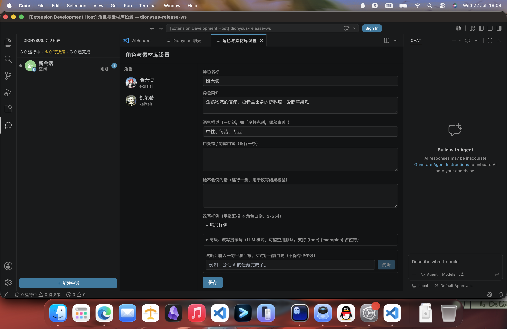

*设置面板：左侧角色列表，右侧语气表单（语气描述、口头禅、绝不会说的话、改写样例、试听、保存）。*

---

## 5. 手机端

### 5.1 扫码配对，一步步来

1. 手机和电脑**连同一个 Wi-Fi**。
2. VS Code 命令面板运行 **「Dionysus: 显示配对二维码」**。如果局域网服务还没开，会先弹一个确认框「需要开启局域网连接才能让手机访问，是否开启？」——点是，自动帮你开，不用手动改设置。
3. 屏幕中央弹出二维码。用手机相机或扫码工具扫它，浏览器会自动打开并完成配对——之后看到的就是手机端首页。

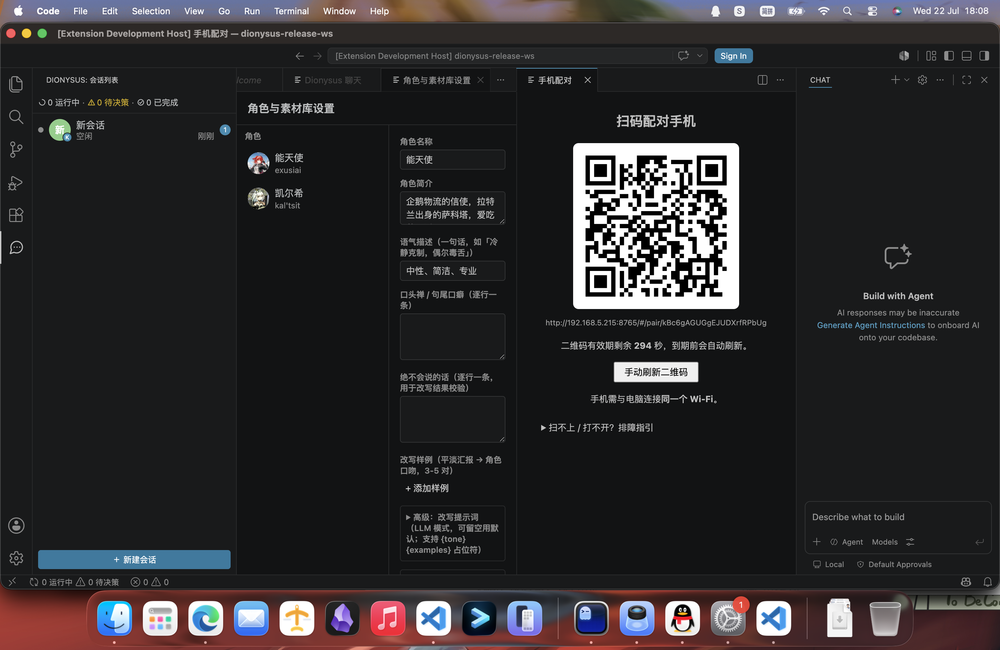

*配对弹层：二维码 + 有效期倒计时（300 秒，快到期自动换新，也可以手动刷新）+ 「同一 Wi-Fi」提示与排障指引。*

扫不出来或扫码后没跳转？配对页底部有个输入框：把二维码链接里 `#/pair/` 后面的配对码贴进去，点「配对」即可。

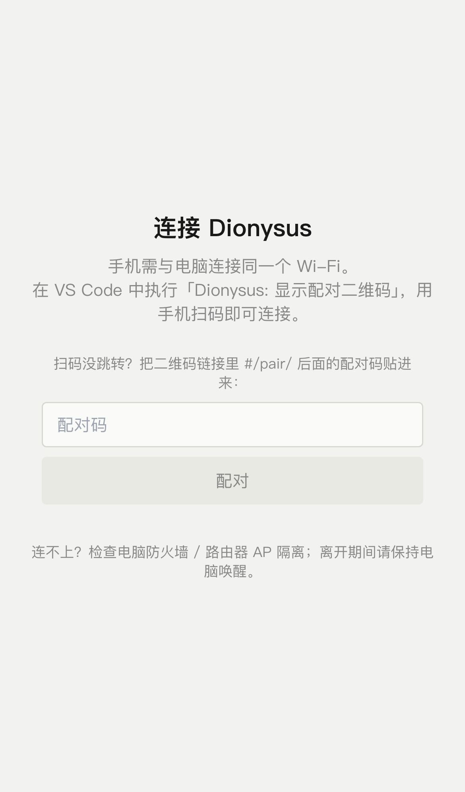

*手机端配对页：可手动粘贴配对码，底部附排障提示。*

> 配对码会过期，过期回到 VS Code 重新弹二维码扫一次就好。已配对的设备可以在设置里撤销；手机上也可以在设置页点「解除本机配对」后重新扫码。
>
> **安全提示**：手机端走的是局域网明文 HTTP，请只在家里等可信 Wi-Fi 下开启；在公司、咖啡厅等公共网络建议保持 `dionysus.lan.enabled` 关闭。

### 5.2 首屏：会话状态列表

打开手机端，第一眼就是会话列表——和桌面同一个规格：头像、状态点、`3/7 · 正在改 auth.ts` 式摘要、未读角标、❗待决策，顶部还有聚合条。哪几个 AI 助手在跑、哪个在等你拍板，一目了然。点任意一行进入对话页。

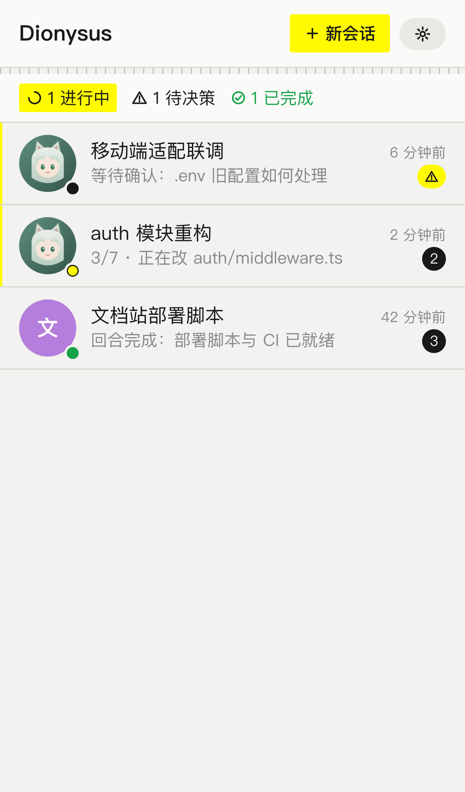

*首屏会话列表：聚合条「1 进行中 · 1 待决策 · 1 已完成」，每行带头像、状态点、摘要和角标。*

### 5.3 三屏用法

**① 对话页**（点列表进入）：消息气泡 + 操作卡片（手机上默认折叠成一行计数，点开展开）。底部三个快捷键：**继续 / 打断 / 确认选项**，外加一个短指令输入框（支持中文输入法，打字过程不会被误发送）。输入框旁有**「离开模式」开关**：打开后 AI 助手自动执行操作、不再逐条找你确认，适合长时间无人值守。

当 AI 助手等你确认选项时，页面顶部会常驻一条醒目的黄色确认条，选项按钮直接内联——回来后第一眼就能看到该点什么。

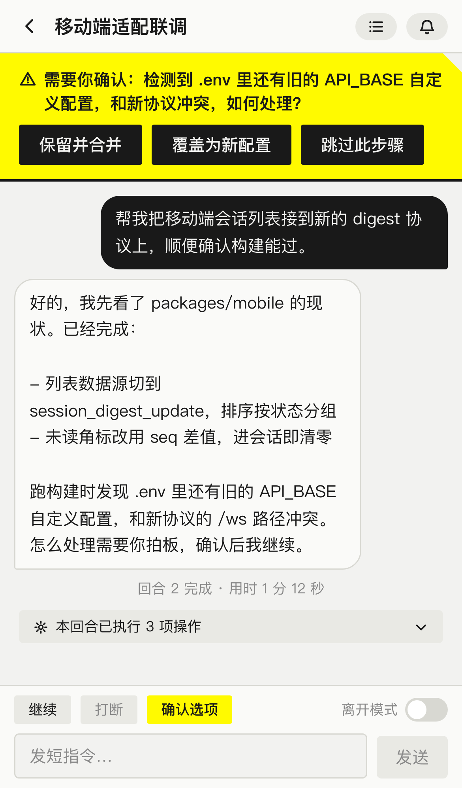

*对话页：顶部常驻确认条（选项内联），下方是消息流、操作计数条和「继续 / 打断 / 确认选项」快捷键。*

**② 工作状态全屏页**：在对话页**向左滑**进入（右滑返回）。这里集中展示这个会话的 todo 进度清单、完整操作时间线、汇报流——「它具体干到哪一步了」，一次横滑就知道。

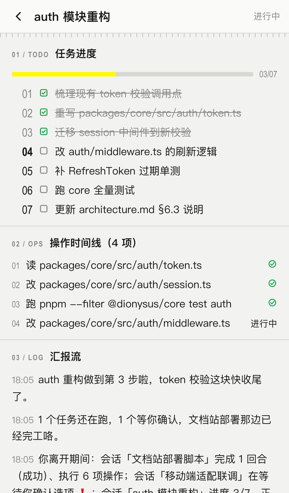

*工作状态页：todo 进度（03/07）、操作时间线明细、汇报流。*

**③ 角色抽屉**：点对话页右上角的铃铛按钮（或在对话页上滑），角色从屏幕底部滑出。抽屉不是全屏——顶部留一条缝，底下的对话流还在实时滚动，不离开上下文也能感知进度。抽屉里是角色立绘 + 最新汇报 + 情绪状态 + 近 20 条汇报流，下拉或点遮罩收起。

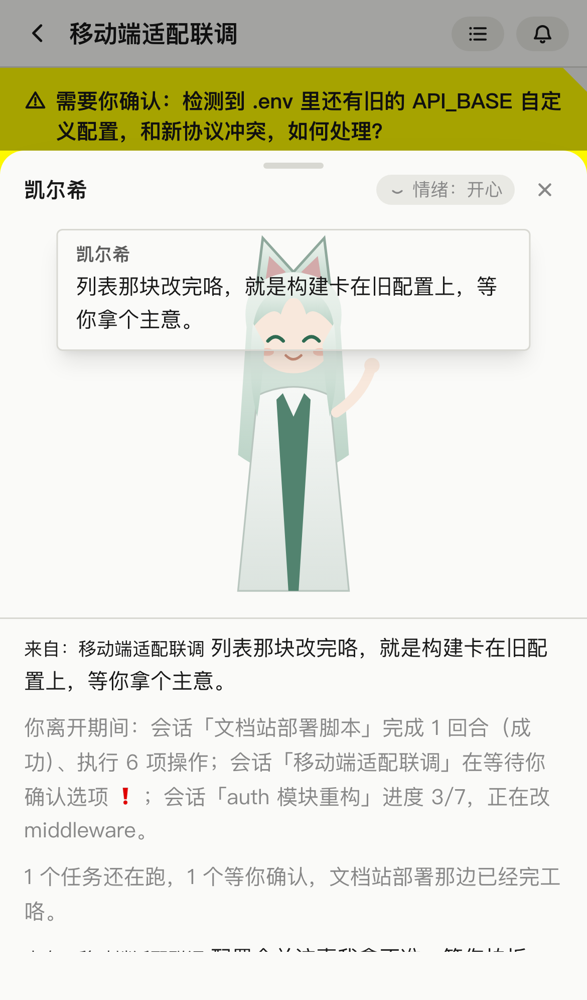

*角色抽屉：凯尔希立绘 + 汇报气泡 + 情绪状态，顶部透出底下的对话流。*

> 手机端角色默认显示 Live2D 动态模型，想省流量可在桌面设置里把 `dionysus.character.display.mobile` 改成 `static`（静态立绘）。手机端的会话设置（改标题/换助手/改目录）是只读的，请回桌面操作。

### 5.4 三态主题

手机端设置页可切换：**浅色 / 深色 / 跟随系统**（默认跟随系统，会随手机系统的深浅色实时变化）。

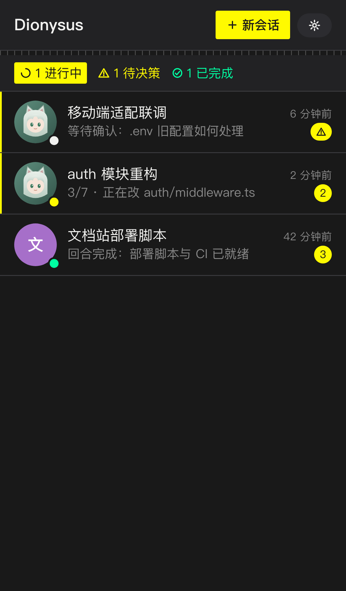

*深色主题：柔和黑而非纯黑。*

### 5.5 锁屏后能做什么

先说结论：**锁屏期间零打扰，解锁打开页面 3 秒内呈现离开期间发生的一切**。

技术上，局域网 HTTP 下手机浏览器没法做系统级推送，这是平台限制，所以 Dionysus 换了个思路：

- 锁屏/切后台时，连接自动挂起，不会耗电刷消息；
- 解锁回到页面，自动重连并补拉离开期间的全部事件；
- 如果离开超过一分钟，首屏顶部会出现一张**「归来摘要」卡**：「你离开的 32 分钟里：会话『auth 重构』完成 1 回合（成功）、执行 14 项操作；会话『mobile 适配』在等待你确认选项 ❗」，点条目直达对应会话。

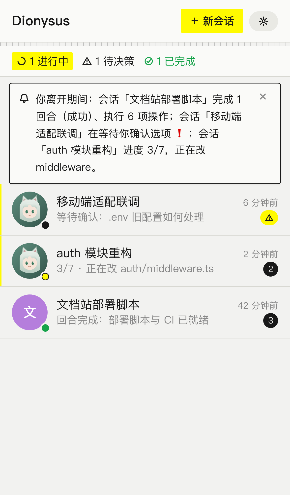

*回到手机端：顶部归来摘要卡汇总离开期间各会话的进展与待办。*

要实时看汇报流，保持浏览器页面在前台即可。

### 5.6 手机端常见问题

- **页面一直转圈 / 提示「无法连接电脑，可能已休眠或 VS Code 已退出」**：电脑休眠或 VS Code 关了。AI 助手跑在电脑上，手机只是个窗口——离开期间请保持电脑唤醒（合盖不休眠）、VS Code 不关。
- **扫码连不上**：按顺序排查：① 手机与电脑是否同一 Wi-Fi；② 路由器是否开了 AP 隔离/客户端隔离（开了就换网络或关掉）；③ 电脑防火墙是否放行了 VS Code 的入站连接；④ 电脑是否休眠。
- **提示配对码无效或已过期**：回 VS Code 重新运行「显示配对二维码」再扫一次。
- **Remote-SSH / 远程开发**：如果环境支持端口转发，二维码会自动用转发地址，可正常配对；否则会明确提示不支持，不会给你一个必然失败的二维码。

---

## 6. 设置项全表

所有设置都在 VS Code 设置里搜 `dionysus` 就能看到，改动即时生效。

| 设置项 | 默认值 | 白话说明 | 建议 |
|---|---|---|---|
| `dionysus.adapter.default` | 空 | 默认用哪个 AI 助手。留空 = 自动用第一个检测到的。 | 只装了一个就留空；装了多个就选定主力 |
| `dionysus.adapters` | `{}` | 高级：自定义 AI 助手配置表（CLI 类型、命令名、可选模型） | 一般用不到，CLI 在 PATH 里就能自动检测 |
| `dionysus.maxConcurrentAgents` | `3` | 同时干活的 AI 助手上限（每个进行中的会话 = 一个 CLI 进程） | 电脑配置一般就保持 3，吃紧可调小 |
| `dionysus.workingDir` | 跟随工作区 | AI 助手的工作目录 | 默认即可，新建会话时也可单独指定目录 |
| `dionysus.persona.default` | 空 | 默认角色。留空 = 按已安装素材自动选 | 出厂即凯尔希，想换在设置面板里选 |
| `dionysus.persona.injectIntoAgent` | `false` | 把角色语气拼进 AI 助手的第一轮输入 | 默认关——角色语气只体现在汇报旁白，不影响 AI 的实际回答。想更深度代入再开 |
| `dionysus.character.display.desktop` | `live2d` | 桌面端角色展示方式：动态模型 / 静态立绘 | 默认即可；机器卡顿可换静态立绘 |
| `dionysus.character.display.mobile` | `live2d` | 手机端角色展示方式 | 默认 Live2D 动态模型，想省流量改成 `static`（静态立绘） |
| `dionysus.session.optionTimeoutAction` | `keep` | AI 助手问你选项、超时没回怎么办：`keep` 继续等 / `deny` 视为拒绝 / `default` 采用默认选项 | 默认 `keep` 最稳妥；长期无人值守可考虑 `default` |
| `dionysus.lan.enabled` | `false` | 局域网服务开关（手机端的前提） | 只在可信 Wi-Fi 下开启 |
| `dionysus.lan.port` | `8765` | 局域网服务端口；被占用会自动往后找 | 一般不用动 |
| `dionysus.supervisor.mode` | `template` | 角色播报怎么生成：`disabled` 关闭 / `template` 内置模板（零成本、离线可用）/ `agent_session` 复用 AI 助手生成（消耗 CLI 额度）/ `deepseek_api` 调 DeepSeek API（消耗 API 额度） | 默认 `template`；想要更生动、更像角色的播报，推荐进阶到 `agent_session` |
| `dionysus.supervisor.intervalSeconds` | `15` | 播报检查进展的间隔（秒），最小 5 | 默认即可 |
| `dionysus.supervisor.adapterId` | 空 | `agent_session` 模式复用哪个 AI 助手，留空跟随默认 | 默认即可 |
| `dionysus.supervisor.llm.baseUrl` | 空 | `deepseek_api` 模式的 API 地址 | 仅 deepseek_api 模式需要 |
| `dionysus.supervisor.llm.model` | 空 | `deepseek_api` 模式的模型名（API key 存在 VS Code 密钥存储里，不会写进配置文件） | 仅 deepseek_api 模式需要；没配 key 会自动退回模板模式，不报错 |

---

## 7. FAQ 与故障排查

**Q：检测不到我装的 CLI？**
A：先确认终端里能直接运行它（比如敲 `kimi` 有反应），并且已登录。然后命令面板运行「Dionysus: 重新检测 AI 助手」。CLI 装在非标准路径时，可以在 `dionysus.adapters` 里手动指定命令名。

**Q：AI 助手旁边出现版本警告角标是什么意思？**
A：表示你本机的 CLI 版本超出了 Dionysus 已适配的范围。只是提醒，**不阻断使用**；如果行为异常，升级或降级 CLI 到适配范围即可。

**Q：配对失败 / 手机连不上？**
A：见 5.6——同一 Wi-Fi、AP 隔离、防火墙、电脑休眠，按顺序查一遍。

**Q：Live2D 不显示 / 角色变成一张静态图？**
A：Live2D 模型加载失败时会自动降级为静态立绘（陪伴功能一切照旧）。检查：① 该角色的素材目录是否完整（`model3.json`、模型文件、纹理都在）；② `dionysus.character.display.desktop` 是否被改成了 `static`；③ 重新打开聊天面板让它重新加载。

**Q：汇报没有角色味 / 干巴巴的？**
A：按这两步查：① 打开「角色与素材库设置」，检查当前角色的 voice 表单——语气描述、口头禅、改写样例填得越具体，口吻越像；用「试听」当场验证。② 播报模式是 `template`（内置模板）时口吻最朴素，想要更生动的改写，把 `dionysus.supervisor.mode` 换成 `agent_session`（复用你已装的 AI 助手）或 `deepseek_api`。另外确认没选错角色——汇报口吻跟随当前聚焦会话的角色。

**Q：角色语气会改变 AI 的回答吗？**
A：默认不会。角色口吻只活在汇报旁白里（AI 输出经过一道「改写」工序才变成角色台词），AI 助手收到的输入和给出的实质回答原封不动。想让 AI 的回答本身也带角色味，开 `dionysus.persona.injectIntoAgent`。

**Q：手机锁屏后收不到实时推送？**
A：这是平台限制，不是 bug。正确姿势见 5.5：锁屏零打扰，解锁 3 秒看全。

**Q：聊天面板被其他面板挡住，怕错过进展？**
A：看两处就行：活动栏 Dionysus 图标上的数字角标，和底部状态栏的「⏳N 运行中 ❗M 待决策」（点它聚焦会话列表）。

### 各助手怎么选模型

「角色与素材库设置」页的「AI 助手与模型」区可以给每个助手配模型（写入 `dionysus.adapters.<助手>.model`）；新建会话时 sidebar 的「选项」面板也能临时指定。各 CLI 的选模型方式不一样：

- **kimi**：支持（对应 CLI 的 `-m` 别名参数），在设置页或「选项」面板填模型别名即可，如 `kimi-code/kimi-for-coding`。别名定义在本机 `~/.kimi-code/config.toml` 的 `[models.*]` 段（本机已有 `moonshot-cn/kimi-k2.5`、`moonshot-cn/kimi-k2.6`、`kimi-code/kimi-for-coding` 等）；kimi 的默认模型 `moonshot-cn/kimi-k2.6` 目前不稳定（print 模式会挂起超时），**建议显式填 `kimi-code/kimi-for-coding`**。
- **claude**：支持。模型名如 `claude-sonnet-4-5`（对应 CLI 的 `--model` 参数），在设置页或「选项」面板填即可。
- **opencode**：支持（对应 `--model`），填你的 provider/model 名。
- **codex**：不支持选模型——`codex exec` 没有 `--model` 参数，设置页会标注「该助手不支持选模型」。
- **codebuddy**：支持（对应 `--model`）。注意先确认已在终端里登录过 codebuddy，否则配了模型也跑不起来。
